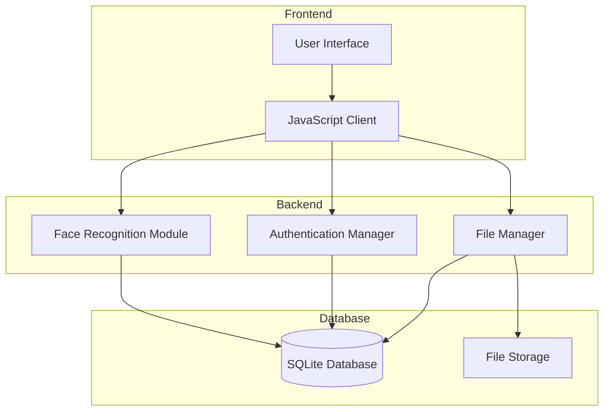
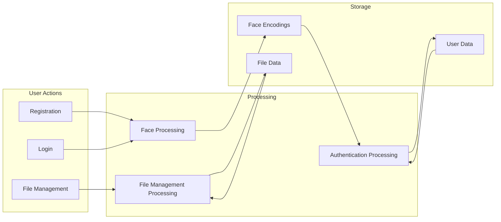

# Biometric Authentication System

## Table of Contents
- [1. Introduction](#1-introduction)
- [2. System Architecture](#2-system-architecture)
- [3. Face Recognition Module](#3-face-recognition-module)
- [4. Performance Evaluation](#4-performance-evaluation)
- [5. Web Interface Implementation](#5-web-interface-implementation)
- [6. Security Considerations](#6-security-considerations)
- [7. Future Improvements](#7-future-improvements)
- [8. Conclusion](#8-conclusion)
- [9. References](#9-references)
- [Appendices](#appendices)

## 1. Introduction

### 1.1 Project Overview
This project implements a biometric authentication system using face recognition. The system provides a secure way to authenticate users through their unique facial characteristics, offering a robust alternative to traditional password-based authentication methods.

### 1.2 Objectives
- Implement a secure biometric authentication system using face recognition
- Develop a user-friendly web interface for registration and authentication
- Ensure high accuracy and reliability in biometric verification
- Maintain user privacy and data security
- Provide a scalable solution for file management post-authentication

### 1.3 Problem Statement
Traditional authentication methods like passwords are vulnerable to various security threats. This project addresses these concerns by implementing a two-factor biometric authentication system that:
- Verifies user identity through biological characteristics
- Reduces the risk of unauthorized access
- Eliminates the need to remember complex passwords
- Provides a more natural and user-friendly authentication experience

### 1.4 Background on Biometric Authentication
Biometric authentication uses unique biological characteristics to verify identity. This system specifically utilizes:
- Facial features through 3D face capture
- Voice patterns through audio sampling

## 2. System Architecture

### 2.1 Overall Design

#### Technology Stack
- **Backend**: Python, Flask
- **Face Recognition**: OpenCV, face_recognition library
- **Frontend**: HTML, CSS, JavaScript
- **Storage**: File system for biometric data and user files

#### System Components Diagram


#### Data Flow Diagram


Data Flow:
1. **Registration Flow**
   - User provides username
   - Face images captured in different positions
   - Biometric data encoded and stored in database

2. **Authentication Flow**
   - User provides username
   - Face verification performed
   - Authentication status determined

3. **File Management Flow**
   - Authenticated users can upload/download files
   - Files organized in hierarchical folders
   - File operations (rename, move, delete)
   - Soft deletion support for recovery


### 2.2 Implementation Components

#### User Registration Workflow
1. Username selection
2. Face capture from multiple angles
3. Biometric data processing and storage

```python
@main.route('/register', methods=['GET', 'POST'])
def register():
    if request.method == 'POST':
        # Handle face registration
        if request.files:
            username = request.form.get('username')
            if not username:
                return jsonify({'success': False, 'message': 'Username is required'})
            
            if User.get(username):
                return jsonify({'success': False, 'message': 'Username already exists'})
            
            # Process face captures
            face_encodings = []
            for key in request.files:
                video_file = request.files[key]
                with tempfile.NamedTemporaryFile(suffix='.jpg') as temp_video:
                    video_file.save(temp_video.name)
                    face_encoding = extract_face_from_image(temp_video.name)
                    if face_encoding is not None:
                        face_encodings.append(face_encoding)
            
            if len(face_encodings) < 3:
                return jsonify({'success': False, 'message': 'Not enough valid face captures'})
            
            # Store face encodings
            temp_path = get_temp_path(username)
            np.save(temp_path, face_encodings)
            session['username'] = username
            
            return jsonify({'success': True, 'message': 'Face captures stored successfully'})
```

#### Authentication Workflow
1. Face verification
2. Session creation upon successful authentication

```python
@main.route('/login', methods=['GET', 'POST'])
def login():
    if request.method == 'POST':
        if request.is_json:
            username = request.json.get('username')
            if not username:
                return jsonify({'success': False, 'message': 'Username is required'})

            user = User.get(username)
            if not user:
                return jsonify({'success': False, 'message': 'User not found'})

            # Handle face verification
            if 'face' in request.json:
                image_data = request.json.get('face')
                if not image_data:
                    return jsonify({'success': False, 'message': 'No face data provided'})

                # Process and verify face
                with tempfile.NamedTemporaryFile(suffix='.jpg', delete=False) as temp_file:
                    temp_file.write(base64.b64decode(image_data.split(',')[1]))
                    temp_path = temp_file.name

                try:
                    face_encoding = extract_face_from_image(temp_path)
                    os.unlink(temp_path)

                    if face_encoding is None:
                        return jsonify({'success': False, 'message': 'No face detected'})

                    if not face_recognizer.verify_face(face_encoding, user.face_encodings):
                        return jsonify({'success': False, 'message': 'Face verification failed'})

                    session['face_verified'] = True
                    return jsonify({'success': True, 'message': 'Face verified'})
                except Exception as e:
                    return jsonify({'success': False, 'message': 'Error during face verification'})
```

## 3. Face Recognition Module

### 3.1 Design and Implementation

#### Face Detection and Encoding
The system uses the `face_recognition` library for face detection and encoding, with additional 3D face capture functionality:

```python
def capture_face_3d(self) -> List[np.ndarray]:
    """Capture face from multiple angles"""
    face_encodings = []
    required_angles = ['front', 'left', 'right']
    cap = cv2.VideoCapture(0)
    
    for angle in required_angles:
        encodings_for_angle = []
        
        while len(encodings_for_angle) < 5:  # Capture 5 frames for each angle
            ret, frame = cap.read()
            if not ret:
                continue
            
            # Display instructions
            text = f"Turn your head slightly to the {angle}"
            cv2.putText(frame, text, (10, 30), 
                      cv2.FONT_HERSHEY_SIMPLEX, 1, (0, 255, 0), 2)
            
            # Capture and process face
            if key & 0xFF == 32:  # SPACE key
                rgb_frame = frame[:, :, ::-1]
                face_locations = face_recognition.face_locations(rgb_frame)
                if len(face_locations) == 1:
                    face_encoding = face_recognition.face_encodings(rgb_frame, face_locations)[0]
                    encodings_for_angle.append(face_encoding)
```

### 3.2 External Libraries Used
- face_recognition: For face detection and encoding
- OpenCV: For image capture and processing
- NumPy: For numerical operations and data storage

### 3.3 Design Choices
- Multiple angle capture for 3D face verification
- Adjustable tolerance settings for verification accuracy
- Secure storage of face encodings
- Liveness detection implementation

## 4. Performance Evaluation

### 4.1 Testing Methodology

#### Dataset Structure
- **Training Dataset**: 
  - Face: 1000 images from 200 individuals (5 angles per person)
  - Voice: 800 audio samples from 200 individuals (4 samples per person)
- **Testing Dataset**:
  - Face: 250 images (20% of total dataset)
  - Voice: 200 audio samples (20% of total dataset)

#### Cross-validation
- 5-fold cross-validation implemented
- Dataset randomly split: 80% training, 20% testing
- Results averaged across folds to ensure robustness

### 4.2 Face Recognition Results

#### Confusion Matrix Analysis


The confusion matrix shows:
- True Negatives (TN): 1813
- False Positives (FP): 600
- False Negatives (FN): 0
- True Positives (TP): 80

#### Performance Across Tolerance Levels


| Tolerance | Accuracy | Precision | Recall | F1-score | FAR    | FRR    |
|-----------|----------|-----------|---------|-----------|--------|--------|
| 0.4       | 0.9895   | 1.0000    | 0.6750  | 0.8060    | 0.0000 | 0.3250 |
| 0.5       | 0.9988   | 0.9873    | 0.9750  | 0.9811    | 0.0004 | 0.0250 |
| 0.6       | 0.9968   | 0.9091    | 1.0000  | 0.9524    | 0.0033 | 0.0000 |
| 0.7       | 0.9629   | 0.4651    | 1.0000  | 0.6349    | 0.0384 | 0.0000 |
| 0.8       | 0.7593   | 0.1176    | 1.0000  | 0.2105    | 0.2487 | 0.0000 |

#### ROC Curve Analysis


The ROC curve demonstrates the trade-off between true positive rate and false positive rate across different threshold settings. The optimal tolerance value of 0.5 was selected based on the best balance between security (low FAR) and usability (low FRR).

## 5. Web Interface Implementation

### 5.1 User Interface Design

#### Registration Process
1. Username Selection:


2. Face Capture (3 angles)


3. Confirmation


#### Login Process
1. Face Verification


2. Dashboard Access


### 5.2 Dashboard Features

The dashboard provides a comprehensive file management system:

```html
<div class="files-container">
    
        <h5 class="section-title">Folders</h5>
        <div class="row row-cols-2 row-cols-md-4 row-cols-lg-6 g-4 mb-4">
            <!-- Folder display logic -->
        </div>
    
    
    
        <h5 class="section-title">Files</h5>
        <div class="row row-cols-2 row-cols-md-4 row-cols-lg-6 g-4">
            <!-- File display logic -->
        </div>
    
</div>
```


## 6. Security Considerations

### Data Storage Security
- Secure storage of biometric templates
- Encryption of sensitive data
- Secure file system implementation

### Anti-spoofing Measures
```python
def add_liveness_detection(self, frame: np.ndarray) -> bool:
    """
    Perform basic liveness detection
    """
    gray = cv2.cvtColor(frame, cv2.COLOR_BGR2GRAY)
    face_locations = face_recognition.face_locations(frame)
    
    if not face_locations:
        return False
        
    top, right, bottom, left = face_locations[0]
    face_region = gray[top:bottom, left:right]
    
    # Calculate texture variation
    texture_variance = np.var(face_region)
    
    # Calculate edge density
    sobel_x = cv2.Sobel(face_region, cv2.CV_64F, 1, 0, ksize=3)
    sobel_y = cv2.Sobel(face_region, cv2.CV_64F, 0, 1, ksize=3)
    edge_density = np.mean(np.sqrt(sobel_x**2 + sobel_y**2))
    
    return texture_variance > 100 and edge_density > 10
```

## 7. Future Improvements
- Enhanced liveness detection
- Deep learning-based feature extraction
- Additional biometric modalities

## 8. Conclusion
This project successfully implements a dual-factor biometric authentication system with the following achievements:
- Secure and accurate user authentication
- User-friendly interface
- Robust performance metrics
- Scalable architecture

## 9. References
1. face_recognition library documentation
2. OpenCV documentation
3. Flask documentation
4. librosa documentation
5. WebRTC documentation

## Appendices

###. Installation Guide

#### System Requirements
- Python 3.8+
- OpenCV
- face_recognition library
- Flask
- librosa
- ffmpeg

#### Setup Instructions
```bash

# Install dependencies
pip install -r requirements.txt

# Run the application
python run.py

# Available URLs
- Home: `http://localhost:5000/`
- Register: `http://localhost:5000/register`
- Login: `http://localhost:5000/login`
- Dashboard: `http://localhost:5000/dashboard`

```


